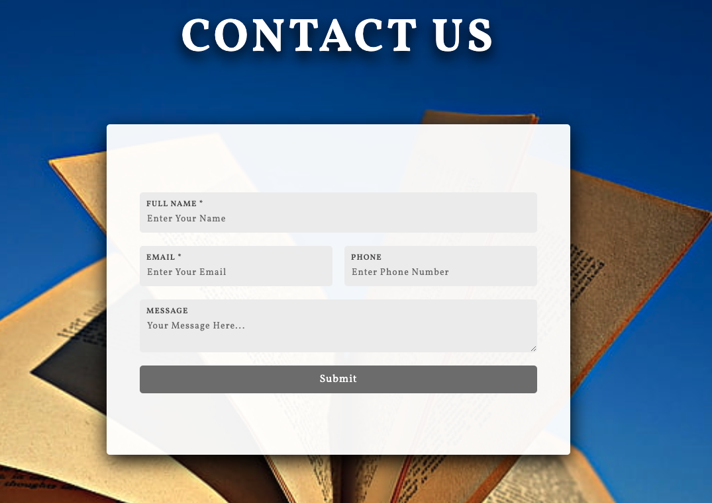

## Build website for BAIZONN Learning Center.

The project uses HTML, CSS, and Javascript to build a static website for Baizonn learning center. It inludes header section to show the important notice, navigation menu bar, popular program cards, learning center story secions, and contact section.

## Websit URL

paste url here

## Website overview

### header section

## Navibar section

## Program section

## Story section

## contact section

## Responisve web design.

- The web page can adapt to different screen sizes and devices.

  

  
