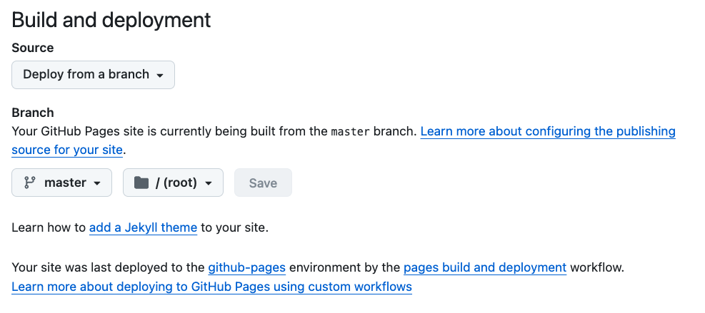

## Team members

- A
- B
- C
- D

## Roles

- A
  - prepare website content and website layout.
- B
  - focus on coding HTML, CSS, JS
- C
  - code review
- D
  - study to website deployment and publish the website at github.
- E
  - adjust image resolution and size, improve the CSS style.
- F
  - Test all code and website

## Deployment

The website is a static website. It includes the following files.

- HTML files
- CSS files
- Javascript files
- images files

## Github deployment

- The github can host this websie because it just inludes HTML, CSS, JS files.

### Deploy steps.

1.  create a repo at github.
2.  push all files to the master branch.
3.  log in to github repo webpage and click "setting".
4.  choose "pages" at left pane.
5.  set up source and Branch according to the following chart.

    

6.  the website url will be appeard at the top of page, under github pages. You need to wait for minutes and refresh the page.

## AWS deployment

- Here is guidance to host website at AWS. [Hosting a static website using Amazon S3](https://docs.aws.amazon.com/AmazonS3/latest/userguide/WebsiteHosting.html)

## Google cloud deployment

- Here is guidance to host website at Google cloud. [Hosting a static website using HTTP ](https://cloud.google.com/storage/docs/hosting-static-website-http)

## Microsoft Azure deployment

- Here is guidance to host website at Google cloud. [Host a static website in Azure Storage ](https://learn.microsoft.com/en-us/azure/storage/blobs/storage-blob-static-website-how-to?tabs=azure-portal)
